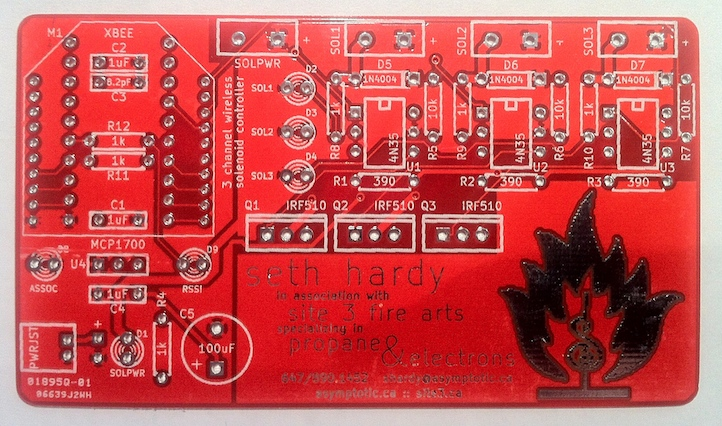
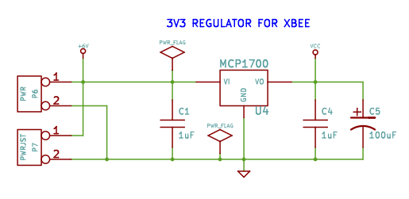
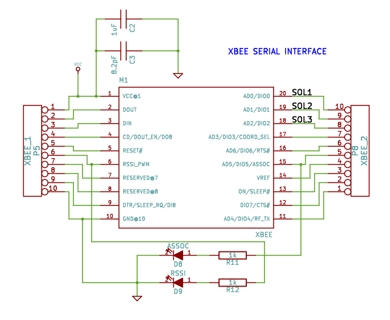
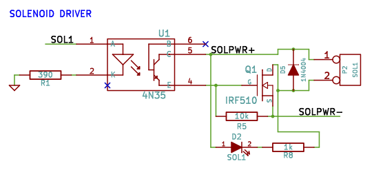

bcard-xbee
----------

Mid-2011, I had the idea of making a PCB business card. At the time I was working on Super Street Fire, and developing a [wireless solenoid controller](https://github.com/propane-and-electrons/wifire16) for triggering flame effects. I took the same basic idea, removed everything unnecessary (including the microcontroller), and set aside an area for contact info. With the remaining space, I found I could fit three optoisolator/MOSFET circuits comfortably.

The end result is this, a three channel wireless solenoid controller.

Yes, it is fully functional.

Please do not call me in the middle of the night and breathe heavily into the phone.

### Feature Summary

### Design
I do give these cards out to people during normal business card exchange rituals. So, I chose to use only through hole parts: people often have little or no experience assembling electronics, so it was designed to be as easy as possible. XBee radios were also chosen for their ease of use.

The card itself is the same size as a normal business card. I have them made on 0.8mm FR4.

#### Power
The card has two separate power inputs: one for the control system, and one for the solenoid power that it switches. This allows the card to be powered off a 3.7V LiPo battery (with 2 pin JST header) or 3xAA/AAA battery pack, while switching 12V, 24V, or higher voltage DC to activate the solenoids.

Since this was designed for fire art, having a separate solenoid power source allows a deadman switch inline, so the dangerous side can be shut down immediately while keeping the controller side active. The two sides are separated via optoisolators.

#### Data
The card uses an XBee radio (Series 1 or 2) for wireless communication. The card does not have a microcontroller on it: the outputs are triggered directly via DIO lines 0 – 2 of the XBee.

This means that a Series 1 radio is preferable, as they can do IO line pairing: change the IO line on the sending radio and it will trigger the output on the receiving radio automatically. Series 2 radios will also work using a remote AT packet to control the line.

#### Solenoid control
The solenoid power is switched using MOSFETs. Each channel has a LED indicator that lights up only when the channel is active.

### Documents

* [Schematic](docs/bcard-xbee-schematic.pdf)
* [Bill of Materials](docs/bcard-xbee-BOM.csv)

